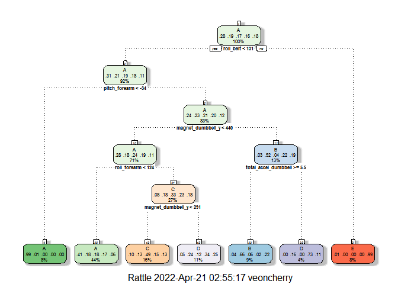
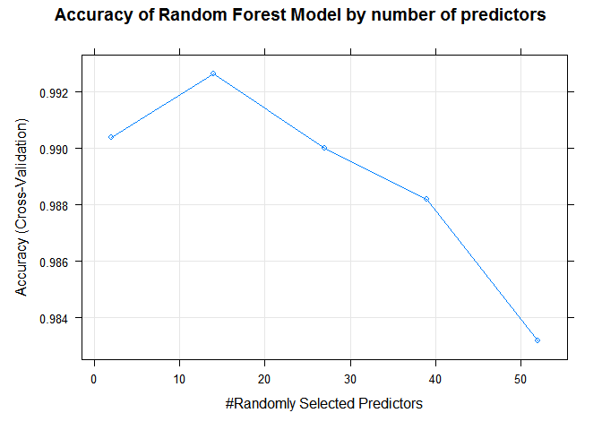
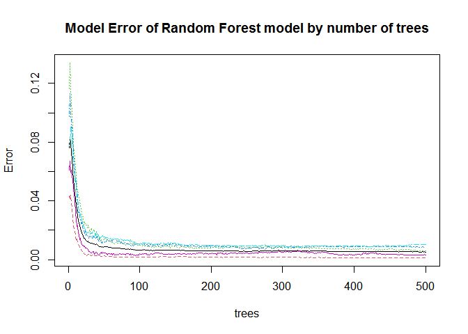

# Machine Learning Prediction Analysis of Weight Lifting Measurements on Exercise/Activity Manners

# Background and Overview 
Using devices such as Jawbone Up, Nike FuelBand, and Fitbit it is now possible to collect a large amount of data about personal activity relatively inexpensively.  These type of devices are part of the quantified self movement – a group of enthusiasts who take measurements about themselves regularly to improve their health, to find patterns in their behavior, or because they are tech geeks.  One thing that people regularly do is quantify how much of a particular activity they do, but they rarely quantify how well they do it.  

In this project, we aim to use data from accelerometers on the belt, forearm, arm, and dumbbell of 6 participants, to predict the manner in which they did the exercise, which is represented in the “classe” variable in the training set.  They were asked to perform barbell lifts correctly and incorrectly in 5 different ways, which corresponds from Class A to Class E as below: 
•	Class A - exactly according to the specification 
•	Class B - throwing the elbows to the front
•	Class C - lifting the dumbbell only halfway
•	Class D - lowering the dumbbell only halfway
•	Class E - throwing the hips to the front  
Only Class A is the correct performance, and the other 4 classes correspond to other common mistakes. 
More information is available from the website here: http://groupware.les.inf.puc-rio.br/har (see the section on the Weight Lifting Exercise Dataset).

This report will address how the model was built, how cross validation was used, what the expected out-of-sample is, and why the choices were made.  Finally the prediction model will be used to predict 20 test cases. 

# Data Processing and Visualization
We started by loading the necessary libraries and dataset, followed by downloading the raw data and providing some basic data visualization.  

```r
knitr::opts_chunk$set(echo = TRUE)
# Loading necessary libraries
library(caret)
```

```
## Warning: package 'caret' was built under R version 4.1.1
```

```
## Loading required package: lattice
```

```
## Loading required package: ggplot2
```

```r
library(rattle)
```

```
## Warning: package 'rattle' was built under R version 4.1.1
```

```
## Loading required package: tibble
```

```
## Loading required package: bitops
```

```
## Rattle: A free graphical interface for data science with R.
## Version 5.4.0 Copyright (c) 2006-2020 Togaware Pty Ltd.
## Type 'rattle()' to shake, rattle, and roll your data.
```

```r
library(ggplot2)
```

```r
if(!file.exists("./data")) dir.create("./data")
trainUrl <- "https://d396qusza40orc.cloudfront.net/predmachlearn/pml-training.csv"
testUrl <- "https://d396qusza40orc.cloudfront.net/predmachlearn/pml-testing.csv"
if (!file.exists("./data/pml-training.csv")) 
{ download.file(trainUrl, destfile="./data/pml-training.csv")}
if (!file.exists("./data/pml-testing.csv")) 
{ download.file(testUrl, destfile="./data/pml-testing.csv")}

traincsv <- read.csv("./data/pml-training.csv")
testcsv <- read.csv("./data/pml-testing.csv")
```


```r
dim(traincsv)
```

```
## [1] 19622   160
```

```r
dim(testcsv)
```

```
## [1]  20 160
```

```r
sum(is.na(traincsv))
```

```
## [1] 1287472
```

```r
sum(is.na(testcsv))
```

```
## [1] 2000
```

```r
names(traincsv)[names(traincsv) != names(testcsv)]
```

```
## [1] "classe"
```

```r
names(testcsv)[names(traincsv) != names(testcsv)]
```

```
## [1] "problem_id"
```

There are 19622 observations and 160 variables in the training data, while the testing data contains 20 observations and the same variables as the training set.  The outcome of this giving classification problem is determined to be the variable ‘classe’ in the last column in the training set.  However, the outcome variable ‘classe’ does not exist in the testing set, instead represented by another variable ‘problem_id’ as identification purposes of the 20 test cases for the submission of the prediction results.
  
There is a considerable number of NA or missing values.  Columns (predictors) that do not produce any information, such as NA values, will be removed to easier the analysis process.  


```r
training <- traincsv[, colSums(is.na(traincsv)) == 0]
testing <- testcsv[, colSums(is.na(testcsv)) == 0]
dim(training)
```

```
## [1] 19622    93
```

```r
dim(testing)
```

```
## [1] 20 60
```
We will continue to remove the first seven predictors (such as X, user name, timestamps) since these variables do not make intuitive sense for prediction and believe to have little impact for the outcome classe.  We will also get rid of near zero variance predictors (zero covariates) as these variables are not useful when constructing a prediction model.


```r
trainingA <- training[, -c(1:7)]
testingA <- testing[, -c(1:7)]
dim(trainingA)
```

```
## [1] 19622    86
```

```r
dim(testingA)
```

```
## [1] 20 53
```

```r
#Remove near zero variance variables
nzv <- nearZeroVar(trainingA)
trainData <- trainingA[,-nzv]
dim(trainData)
```

```
## [1] 19622    53
```

```r
nvzTest <- nearZeroVar(testingA)
nvzTest
```

```
## integer(0)
```

```r
testData <- testingA
dim(testData)
```

```
## [1] 20 53
```

After the data cleaning process above, the number of variables (predictors) has been reduced to 53 from 160.  No near zero covariate for the testing data has been found.  It is shown that our training data have the same column numbers (predictors) as the testing data has for the prediction model.

# Prediction Model Building and Selection
To practice cross validation, the given training data is partitioned into 70% training and 30% testing (validation).  The original testing data (testData) will stay as is and will be used later for the final prediction of the 20 different test cases.


```r
set.seed(12345)
inTrain <- createDataPartition(trainData$classe, p = 0.7, list = FALSE)
train <- trainData[inTrain,]
valid <- trainData[-inTrain,]
dim(train)
```

```
## [1] 13737    53
```

```r
dim(valid)
```

```
## [1] 5885   53
```
This project is a supervised machine learning problem since we clearly know our project objective and the categorical outcome variable, classe which takes values in a finite, unordered set.  Therefore, we will use supervised classification algorithms for the model prediction.  We will build and consider three different popular models, i.e. Decision Tree, Random Forests, and Gradient Boosted Tree on the training data (sub-training set).  Confusion Matrix will be performed to compare the different models by evaluating the accuracy of models on new data (sub-test set).  The prediction model with the highest accuracy will be selected to use on the untouched independent original testing set (testData) to fulfill the cross validation to predict the 20 different test cases.

### TrainControl
We can specify the type of resampling or set options for how the model will be applied to the training data by creating the trainControl object below.  We use the cross validation method to avoid overfitting effects, to better estimate test error and for better model overall efficiency.  5-fold cross validation is considered when implementing the algorithms to save some computing time.


```r
fitControl <- trainControl(method="cv", number=5)
```

## Decision Tree Model


```r
#Train the model
rpartFit <- train(classe~., data= train, method="rpart", trControl=fitControl, tuneLength = 5)
rpartFit
```

```
## CART 
## 
## 13737 samples
##    52 predictor
##     5 classes: 'A', 'B', 'C', 'D', 'E' 
## 
## No pre-processing
## Resampling: Cross-Validated (5 fold) 
## Summary of sample sizes: 10987, 10990, 10990, 10991, 10990 
## Resampling results across tuning parameters:
## 
##   cp          Accuracy   Kappa     
##   0.02166616  0.5574059  0.43113696
##   0.02797274  0.5406635  0.40938336
##   0.03458448  0.5269759  0.39101780
##   0.06092971  0.3911382  0.16699598
##   0.11595972  0.3326679  0.07359069
## 
## Accuracy was used to select the optimal model using the largest value.
## The final value used for the model was cp = 0.02166616.
```

```r
#Prettier version of plot 
fancyRpartPlot(rpartFit$finalModel, cex = 0.7, tweak = 0.7)
```

```
## Warning: cex and tweak both specified, applying both
```

<!-- -->

```r
#Predicting classe for validation set (valid) using classification tree model  
pred_rpart <- predict(rpartFit, newdata = valid)

#Compare and print results of models 
cm_rpart <- confusionMatrix(factor(valid$classe), pred_rpart)
cm_rpart
```

```
## Confusion Matrix and Statistics
## 
##           Reference
## Prediction    A    B    C    D    E
##          A 1525   29   77   39    4
##          B  484  351  124  180    0
##          C  499   36  423   68    0
##          D  423    9  126  406    0
##          E  153  138  143  167  481
## 
## Overall Statistics
##                                           
##                Accuracy : 0.5414          
##                  95% CI : (0.5285, 0.5542)
##     No Information Rate : 0.524           
##     P-Value [Acc > NIR] : 0.004016        
##                                           
##                   Kappa : 0.402           
##                                           
##  Mcnemar's Test P-Value : < 2.2e-16       
## 
## Statistics by Class:
## 
##                      Class: A Class: B Class: C Class: D Class: E
## Sensitivity            0.4945  0.62345  0.47368  0.47209  0.99175
## Specificity            0.9468  0.85194  0.87921  0.88896  0.88870
## Pos Pred Value         0.9110  0.30817  0.41228  0.42116  0.44455
## Neg Pred Value         0.6298  0.95533  0.90327  0.90774  0.99917
## Prevalence             0.5240  0.09567  0.15174  0.14613  0.08241
## Detection Rate         0.2591  0.05964  0.07188  0.06899  0.08173
## Detection Prevalence   0.2845  0.19354  0.17434  0.16381  0.18386
## Balanced Accuracy      0.7206  0.73769  0.67645  0.68052  0.94023
```
The accuracy has been found to be 0.5414 (55.14%), which is considerable low and the expected out of sample error rate is estimated to be around 44.86%, which is very high. 

## Random Forests Model

```r
#Train the model
rfModFit <- train(classe~., data= train, method = "rf", trControl=fitControl, tuneLength = 5)
rfModFit
```

```
## Random Forest 
## 
## 13737 samples
##    52 predictor
##     5 classes: 'A', 'B', 'C', 'D', 'E' 
## 
## No pre-processing
## Resampling: Cross-Validated (5 fold) 
## Summary of sample sizes: 10990, 10989, 10990, 10990, 10989 
## Resampling results across tuning parameters:
## 
##   mtry  Accuracy   Kappa    
##    2    0.9903908  0.9878442
##   14    0.9926474  0.9906990
##   27    0.9900269  0.9873836
##   39    0.9882071  0.9850815
##   52    0.9831843  0.9787271
## 
## Accuracy was used to select the optimal model using the largest value.
## The final value used for the model was mtry = 14.
```

```r
#Predicting classe for validation set (valid) using random forests model  
predRF <- predict(rfModFit, newdata = valid)

#Compare and print results of models 
cmRF <- confusionMatrix(factor(valid$classe), predRF)
cmRF
```

```
## Confusion Matrix and Statistics
## 
##           Reference
## Prediction    A    B    C    D    E
##          A 1673    1    0    0    0
##          B    4 1134    1    0    0
##          C    0    5 1020    1    0
##          D    0    0    9  954    1
##          E    0    0    1    1 1080
## 
## Overall Statistics
##                                           
##                Accuracy : 0.9959          
##                  95% CI : (0.9939, 0.9974)
##     No Information Rate : 0.285           
##     P-Value [Acc > NIR] : < 2.2e-16       
##                                           
##                   Kappa : 0.9948          
##                                           
##  Mcnemar's Test P-Value : NA              
## 
## Statistics by Class:
## 
##                      Class: A Class: B Class: C Class: D Class: E
## Sensitivity            0.9976   0.9947   0.9893   0.9979   0.9991
## Specificity            0.9998   0.9989   0.9988   0.9980   0.9996
## Pos Pred Value         0.9994   0.9956   0.9942   0.9896   0.9982
## Neg Pred Value         0.9991   0.9987   0.9977   0.9996   0.9998
## Prevalence             0.2850   0.1937   0.1752   0.1624   0.1837
## Detection Rate         0.2843   0.1927   0.1733   0.1621   0.1835
## Detection Prevalence   0.2845   0.1935   0.1743   0.1638   0.1839
## Balanced Accuracy      0.9987   0.9968   0.9940   0.9979   0.9993
```

The accuracy has been found to be 0.9948 (99.48%), which is considerable high and the expected out of sample error rate is estimated to be around 0.52%, which is very low. 

Below are the two reference plots for the random forests model.

```r
plot(rfModFit, main="Accuracy of Random Forest Model by number of predictors")
```

<!-- -->


```r
plot(rfModFit$finalModel, main = "Model Error of Random Forest model by number of trees")
```

<!-- -->

## Generalize Boosted Models

```r
gbmModFit <- train(classe~., data=train, method="gbm", trControl= fitControl, tuneLength = 5, verbose=FALSE)

#Predicting classe for validation set (valid) using generalized boosted model 
predGBM <- predict(gbmModFit, newdata = valid)

#Compare and print results of models 
cmGBM <- confusionMatrix(factor(valid$classe), predGBM)
cmGBM
```

```
## Confusion Matrix and Statistics
## 
##           Reference
## Prediction    A    B    C    D    E
##          A 1671    3    0    0    0
##          B    6 1127    6    0    0
##          C    0   10 1014    2    0
##          D    0    0   13  951    0
##          E    0    2    1    2 1077
## 
## Overall Statistics
##                                           
##                Accuracy : 0.9924          
##                  95% CI : (0.9898, 0.9944)
##     No Information Rate : 0.285           
##     P-Value [Acc > NIR] : < 2.2e-16       
##                                           
##                   Kappa : 0.9903          
##                                           
##  Mcnemar's Test P-Value : NA              
## 
## Statistics by Class:
## 
##                      Class: A Class: B Class: C Class: D Class: E
## Sensitivity            0.9964   0.9869   0.9807   0.9958   1.0000
## Specificity            0.9993   0.9975   0.9975   0.9974   0.9990
## Pos Pred Value         0.9982   0.9895   0.9883   0.9865   0.9954
## Neg Pred Value         0.9986   0.9968   0.9959   0.9992   1.0000
## Prevalence             0.2850   0.1941   0.1757   0.1623   0.1830
## Detection Rate         0.2839   0.1915   0.1723   0.1616   0.1830
## Detection Prevalence   0.2845   0.1935   0.1743   0.1638   0.1839
## Balanced Accuracy      0.9979   0.9922   0.9891   0.9966   0.9995
```

### Summarized Accuracy and Out of Sample Error

```
##         Model  Accuracy Out.of.Sample.Error
## 1 Tree(rpart) 0.5413764         0.458623619
## 2          RF 0.9959218         0.004078165
## 3         GBM 0.9923534         0.007646559
```

# Predictions on (Validation) Test Data

The next possible step might be using the ensembling methods in learning, to combine classifiers by averaging or voting to improve accuracy in the model.  However, given the high accuracy of two models (Random Forests and Generalized Boosting Models) above, and the interpretability reductions and computational complexity increase of the ensembling methods, we will skip these further research efforts for now.
We will use the Random Forests Model that has the highest accuracy as our prediction model to predict the classe for the given 20 different test cases on the original test data. 


```r
pred <- predict(rfModFit, newdata = testData)
pred
```

```
##  [1] B A B A A E D B A A B C B A E E A B B B
## Levels: A B C D E
```

# Conclusions
Based on our analysis above on the prediction model building and selection of the 3 models, i.e. decision trees, random forests, and generalized gradient boosting models, we concluded that the random forests model (with cross validation) with the highest accucracy of 0.9959 and the expected out of sample error of 0.004078 is the best predictive model to use to predict the test cases.    

The outcome of the 20 test cases prediction is listed as below:

```
##    problem_id predicted_classe
## 1           1                B
## 2           2                A
## 3           3                B
## 4           4                A
## 5           5                A
## 6           6                E
## 7           7                D
## 8           8                B
## 9           9                A
## 10         10                A
## 11         11                B
## 12         12                C
## 13         13                B
## 14         14                A
## 15         15                E
## 16         16                E
## 17         17                A
## 18         18                B
## 19         19                B
## 20         20                B
```
